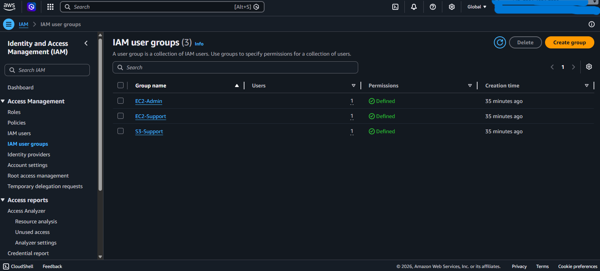
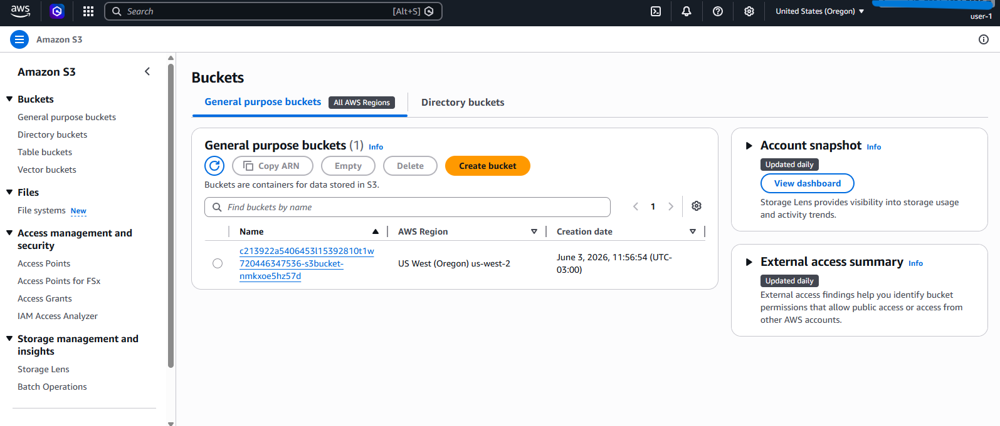
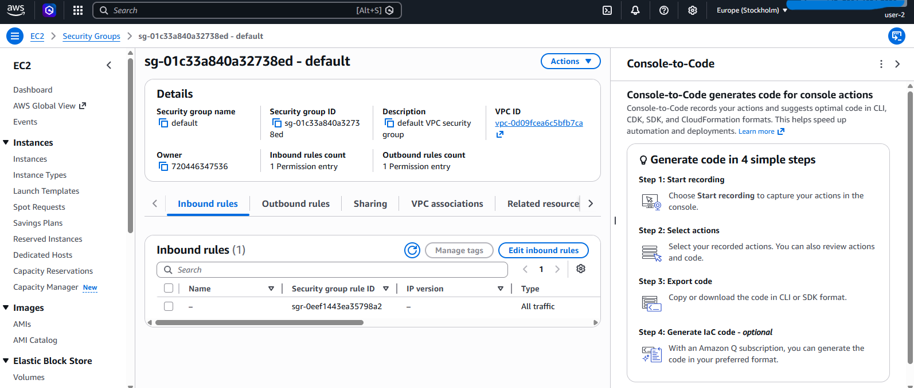
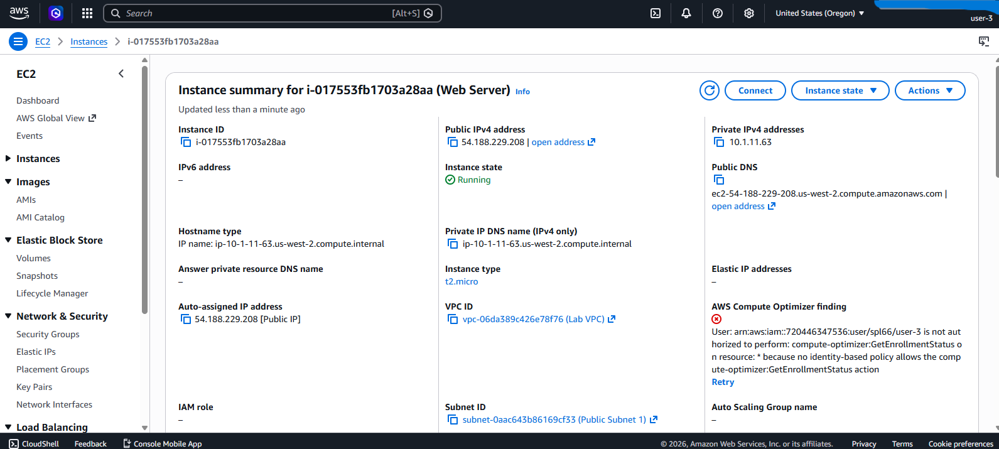
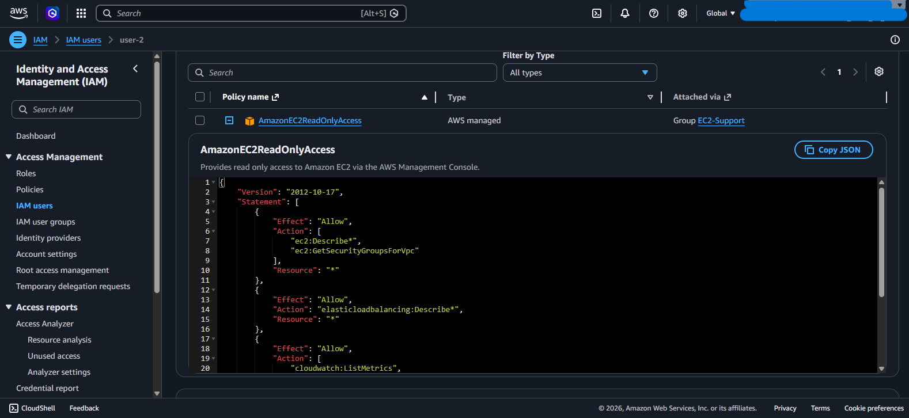

# AWS-IAM-Lab---Identity-and-Access-Management

## Descrição

Projeto prático desenvolvido para aprofundar conhecimentos em AWS IAM (Identity and Access Management), serviço responsável pelo gerenciamento de identidades, usuários, grupos e permissões dentro da AWS.

Durante este laboratório foram realizados procedimentos de criação de usuários, grupos e atribuição de permissões seguindo boas práticas de segurança em nuvem.

---

## Objetivos

- Compreender os conceitos de IAM na AWS.
- Criar usuários e grupos.
- Aplicar políticas de acesso.
- Gerenciar permissões.
- Implementar controle de acesso baseado em funções.
- Desenvolver habilidades voltadas para segurança em ambientes Cloud.

---

## Serviços Utilizados

- AWS IAM
- AWS Management Console

---

## Atividades Realizadas

### 1. Criação de grupos
Acesso ao painel do IAM para gerenciamento de identidades e permissões.

  

---

### 2. Painel de controle IAM

Acesso ao painel do IAM para gerenciamento de identidades e permissões.

  

### 3. Criação de Usuários

Foram criados usuários para simular diferentes perfis de acesso.

#### Usuário 1

  

#### Usuário 2

  

#### Usuário 3

  

---

### 4. IAM

  
</p

---

## Conhecimentos Desenvolvidos

- Identity and Access Management (IAM)
- Controle de acesso baseado em políticas
- Gerenciamento de usuários e grupos
- Segurança em Cloud Computing
- Princípio do Menor Privilégio (Least Privilege)
- Governança de acesso na AWS

---

## Resultado

Este laboratório proporcionou experiência prática com gerenciamento de identidades e permissões na AWS, fortalecendo conhecimentos fundamentais para ambientes de computação em nuvem e preparação para certificações AWS.

---

## Autora

**Viviane Vieira de Souza**

Em transição para a área de Tecnologia da Informação, com foco em Cloud Computing, AWS e Inteligência Artificial.
